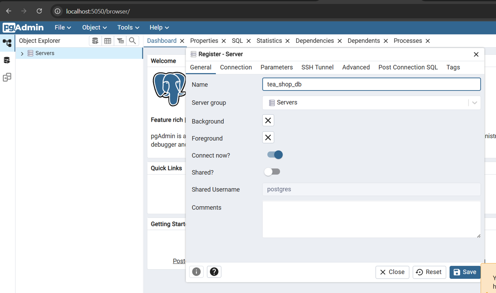

## Инструкция по установке

1. Склонируй репозиторий
2. Перейти в терминале в папку с docker-compose-файлом
3. Запусти команду
```
docker compose up -d --build
```
4. Чтобы перейти в swagger перейди по ссылке
```
http://localhost:8080/swagger/index.html
```
6. Если хочешь перейти в pg admin, вот скриншоты с параметрами подключения:




6. Для того чтобы заработало сидирование базы данных, в Program.cs вынеси код с вызовом метода сидирования из условия и раскомментируй

```
if (app.Environment.IsDevelopment())
{
    // для сидирования базы данных
    // if (args.Contains("--seeding"))
    // {
    //     await app.Services.RunSeeding();
    // }
}
```
